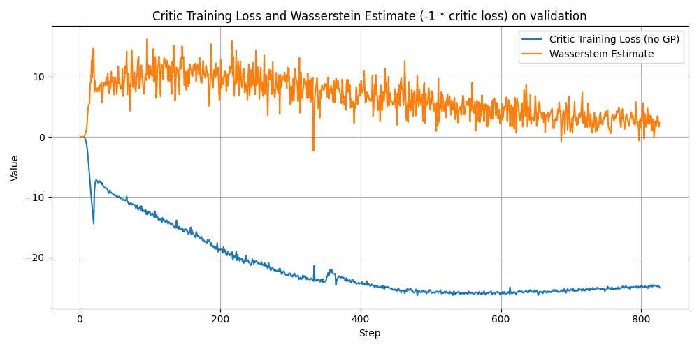
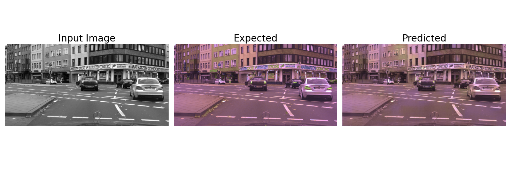
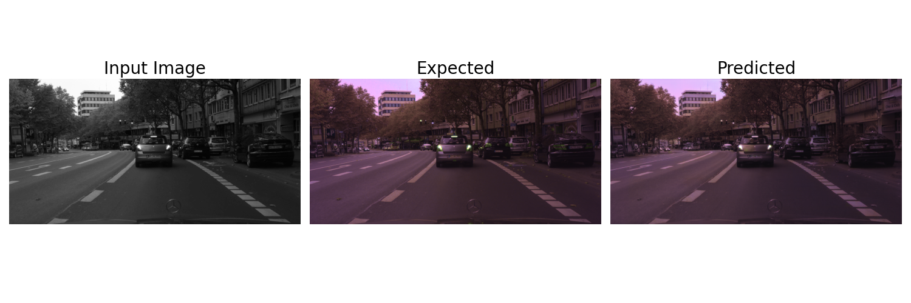

# Image Colorization with Wasserstein GANs

An implementation of WGAN-GP, a Wasserstein GAN with gradient penalty to enforce the Lipschitz smoothness penalty for the critic.
The training scheme and WGAN model are based on the original paper from Arjovsky et al. -- [Wasserstein GAN](https://arxiv.org/abs/1701.07875)

Features a U-Net-based generator and a conditional critic, which are defined in wgan_model.py.
The main training loop and losses for the generator and critic, along with monitoring infrastructure (tensorboard logs, checkpointing), are outlined in training.py. 
Specifically, the method fit_gan() trains the model, while generator_loss() and critic_loss() define the two losses.

Training procedure:
- Pre-trained U-net generator with L1 loss on the colored predictions (around 200 epochs)
- Frozen generator for the first 20 epochs, while training the critic
- Continue joint training of generator + critic while monitoring Wasserstein distance estimate on hold-out validation data

## Training losses (+ Wasserstein estimate)

## Results
The model was evaluated on the Cityscapes dataset, see description [here](https://www.cityscapes-dataset.com/dataset-overview/). We were provided black-and-white inputs and synthetically colored images. 
The pre-trained U-Net successfully colored the images with the correct brownish-red hue, but completely omitted the green and blue details on cars and signs. 
While the WGAN training seemed to improve performance on some finer details, we didn't observe major improvements across the board. The model achieved an [SSIM](https://en.wikipedia.org/wiki/Structural_similarity_index_measure) score of 0.91 on a final (private) test dataset selected by the staff. We visualize predictions on selected inputs below.

